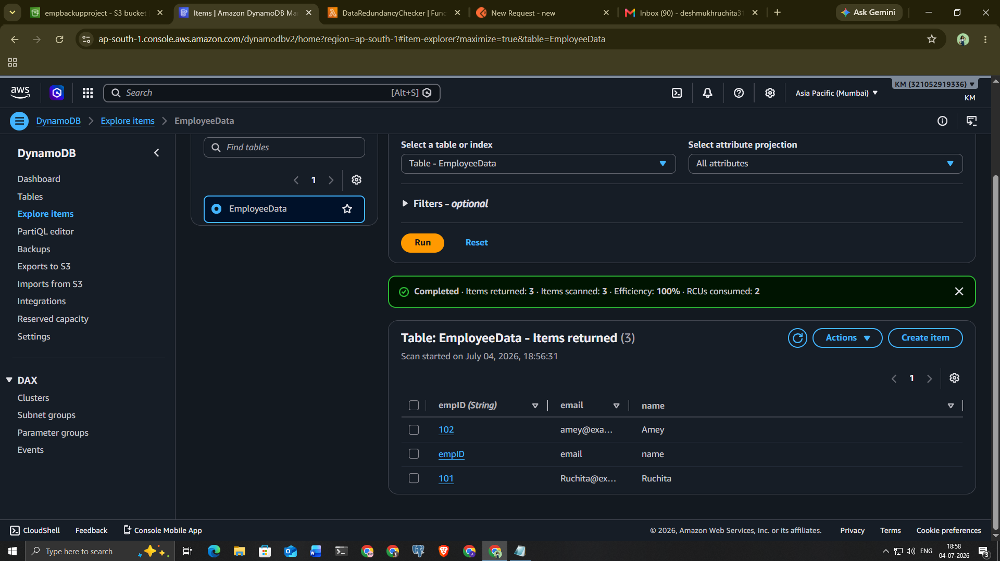
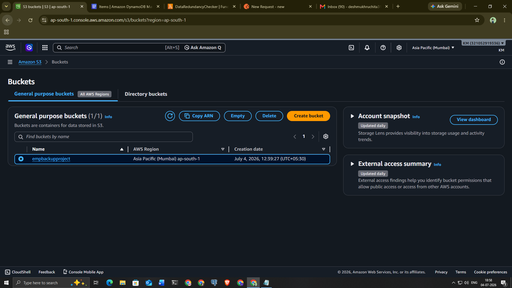
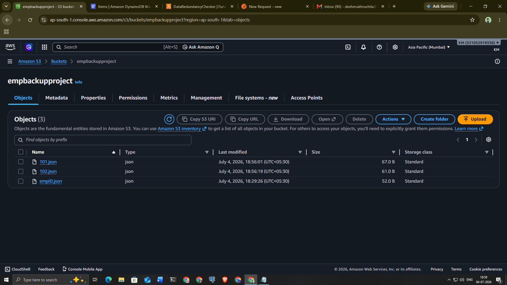
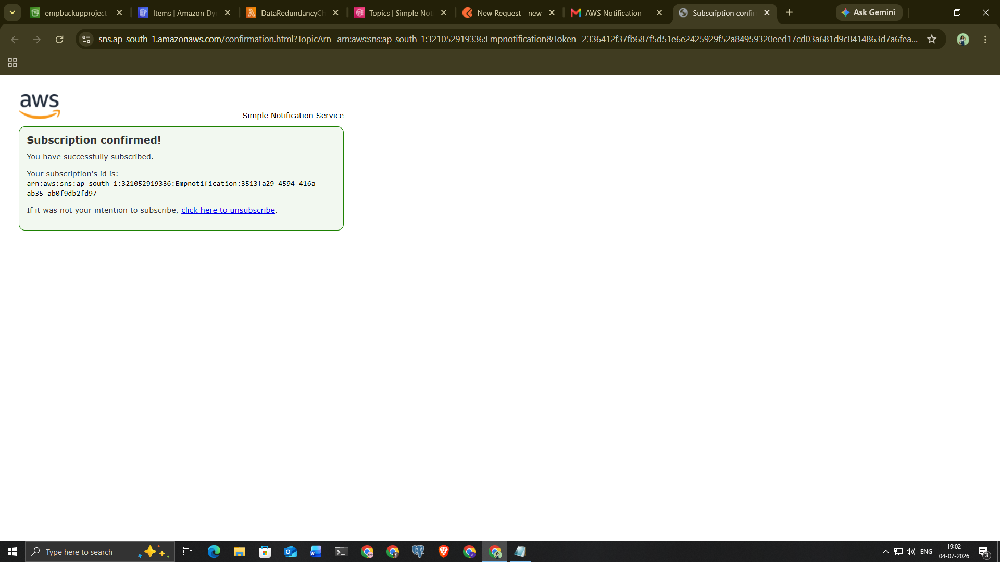
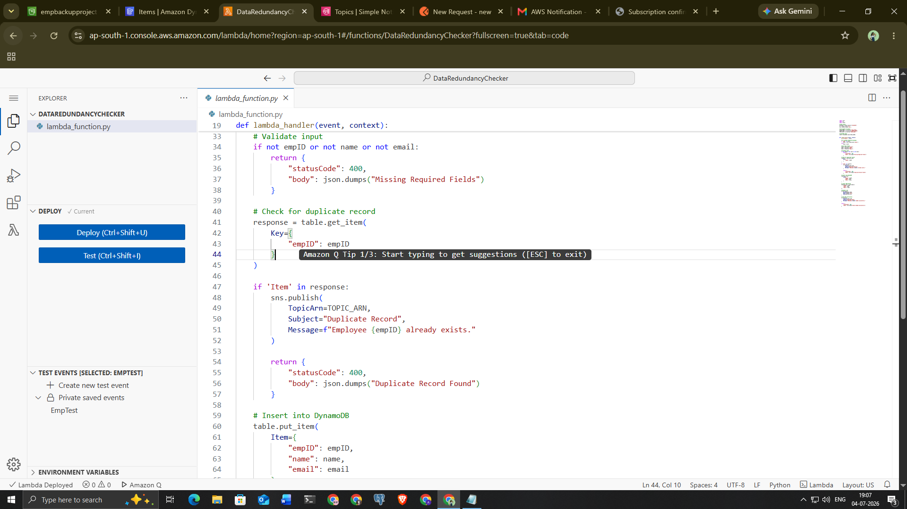
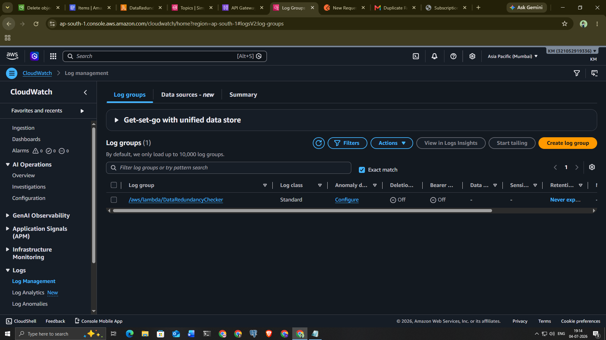
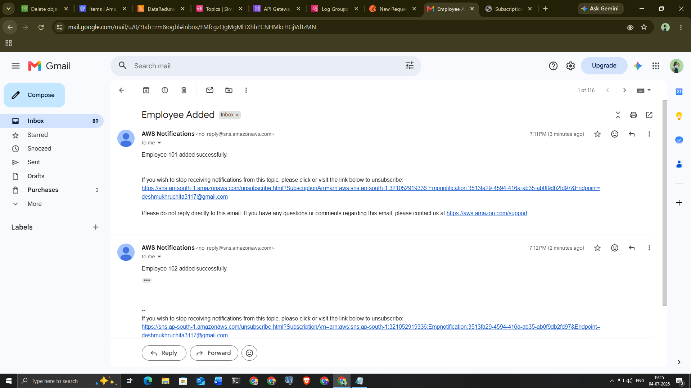
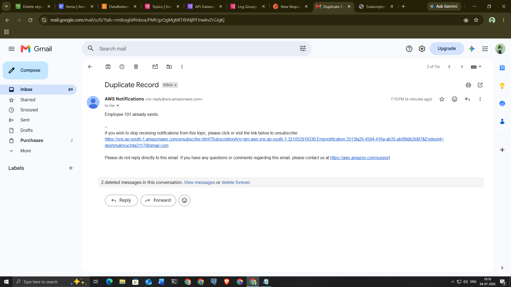

# 🚀 Data Redundancy Removal System Using AWS

A serverless AWS project that detects duplicate employee records, stores only unique records in Amazon DynamoDB, creates JSON backups in Amazon S3, sends email notifications through Amazon SNS, and records execution logs in Amazon CloudWatch.

---

## 📖 Project Overview

The **Data Redundancy Removal System** validates incoming employee records before storing them in the database.

### Project Workflow

- Validate employee information received through the REST API.
- Check whether the employee record already exists in Amazon DynamoDB.
- If the record is a duplicate:
  - Reject the record.
  - Send a duplicate notification using Amazon SNS.
- If the record is unique:
  - Store the employee record in Amazon DynamoDB.
  - Create a JSON backup in Amazon S3.
  - Send a success notification using Amazon SNS.
  - Log the execution details in Amazon CloudWatch.

---

## 🛠️ AWS Services Used

| Service | Purpose |
|---------|---------|
| AWS Lambda | Executes the business logic |
| Amazon API Gateway | Provides REST API endpoint |
| Amazon DynamoDB | Stores employee records |
| Amazon S3 | Stores JSON backup files |
| Amazon SNS | Sends email notifications |
| AWS IAM | Manages permissions |
| Amazon CloudWatch | Stores logs and monitoring |
| Postman | Tests the REST API |

---

## 🔄 System Architecture

```text
                     User
                       │
                       ▼
                   Postman
                       │
                       ▼
             Amazon API Gateway
                       │
                       ▼
                  AWS Lambda
                       │
         Validate Employee Record
                       │
          Check Duplicate Record
                       │
          ┌────────────┴────────────┐
          │                         │
          ▼                         ▼
     Duplicate                 Unique Record
          │                         │
          ▼                         ▼
 Amazon SNS Email         Store in DynamoDB
                                    │
                                    ▼
                           Backup to Amazon S3
                                    │
                                    ▼
                           Amazon SNS Success Email
                                    │
                                    ▼
                           Amazon CloudWatch Logs
```

---

# 📷 Project Screenshots

## 1. Amazon DynamoDB




---

## 2. Amazon S3 Bucket





---

## 3. Amazon SNS




---

## 4. AWS Lambda





---

## 5. Amazon API Gateway


---

## 6. Postman API Testing

### Successful Record


### Duplicate Record


---

## 7. Amazon CloudWatch Logs




---

## 8. Email Notifications





---

## 9. JSON Backup in Amazon S3


---

## 📤 Sample API Request

```json
{
  "employeeId": "101",
  "name": "Navnath",
  "email": "navnath@example.com"
}
```

---

## ✅ Success Response

```json
{
  "statusCode": 200,
  "body": "Record Added Successfully"
}
```

---

## ❌ Duplicate Response

```json
{
  "statusCode": 400,
  "body": "Duplicate Record Found"
}
```

---

## 💻 Technologies Used

- Python
- AWS Lambda
- Amazon API Gateway
- Amazon DynamoDB
- Amazon S3
- Amazon SNS
- AWS IAM
- Amazon CloudWatch
- REST API
- Postman
- Git
- GitHub

---

## 📂 Project Structure

```text
Data-Redundancy-Removal-System
│
├── Lambda_function.py
├── requirements.txt
├── README.md
└── Screenshots
    ├── 1-dynamodb-table.PNG
    ├── 2-dynamodb-table.PNG
    ├── 3-s3-bucket.PNG
    ├── 4-s3-bucket.PNG
    ├── 5-sns-topic.PNG
    ├── 6-sns-topic.PNG
    ├── 7-sns-topic.PNG
    ├── 8-lambda-function.PNG
    ├── 9-lambda-function.PNG
    ├── 10-lambda-function.PNG
    ├── 11-lambda-function.PNG
    ├── 12-api-gateway.PNG
    ├── 13-api-gateway.PNG
    ├── 14-postman-record.PNG
    ├── 15-postman-record.PNG
    ├── 16-postman-duplicate.PNG
    ├── 17-cloudwatch-logs.PNG
    ├── 18-cloudwatch-logs.PNG
    ├── 19-email-notification.PNG
    ├── 20-email-notification.PNG
    └── 21-s3-json-file.PNG
```

---

## ⚙️ Prerequisites

Before running this project, ensure you have:

- AWS Account
- Python 3.x
- AWS CLI configured
- AWS Lambda
- Amazon DynamoDB
- Amazon S3
- Amazon SNS
- Amazon API Gateway
- IAM Role with required permissions
- Postman
- Git

---

## ▶️ How to Run

### 1. Clone the repository

```bash
git clone https://github.com/navnath12345/CodeAlpha_Data_Redundancy_Removal_System.git
```

### 2. Navigate to the project directory

```bash
cd CodeAlpha_Data_Redundancy_Removal_System
```

### 3. Deploy the Lambda function

Upload `Lambda_function.py` to AWS Lambda.

### 4. Configure AWS Services

- Create a DynamoDB table
- Create an S3 bucket
- Create an SNS topic and subscribe an email
- Configure API Gateway
- Assign the required IAM permissions

### 5. Test the API

Use Postman to send employee records through the API Gateway endpoint.

---

## ✨ Features

- ✅ Detects duplicate employee records
- ✅ Prevents redundant data storage
- ✅ Stores unique records in DynamoDB
- ✅ Creates JSON backups in Amazon S3
- ✅ Sends email notifications using SNS
- ✅ REST API integration with API Gateway
- ✅ Serverless AWS architecture
- ✅ CloudWatch logging and monitoring

---

## 👨‍💻 Author

**Navnath Monde**

AWS Cloud Internship Project

**CodeAlpha**

---

## 📄 License

This project is licensed under the MIT License.

---

## ⭐ Support

If you found this project helpful, please give it a **⭐ Star** on GitHub.
